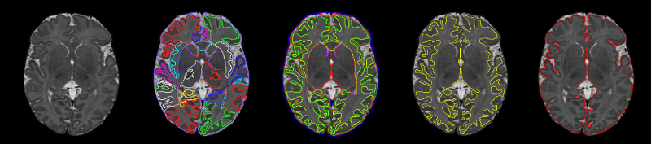

# Draw-EM Segmentation Software



Draw-EM (Developing brain Region Annotation With Expectation-Maximization) is a package of [MIRTK](https://github.com/BioMedIA/MIRTK) developed by Antonios Makropoulos and the [BioMedIA](https://biomedia.doc.ic.ac.uk/) research group. 
It provides a collection of command-line tools and pipelines for the segmentation of developing brain MR images.

Draw-EM is used as part of the [dHCP structural pipeline](https://github.com/BioMedIA/dhcp-structural-pipeline) for the structural analysis (segmentation and surface extraction) of the neonatal brain.


## Dependencies
### FSL

The segmentation pipeline uses
[FSL](https://fsl.fmrib.ox.ac.uk/fsl/fslwiki/FSL). 
See the [installation instructions](https://fsl.fmrib.ox.ac.uk/fsl/fslwiki/FslInstallation) for FSL.


## Installation

Draw-EM is part of MIRTK. 
In order to compile it as part of MIRTK you need to:
- enable compilation of the package by setting the CMake flag "MODULE_DrawEM" of MIRTK to "ON" (using cmake or ccmake)
- build MIRTK

See the [installation instructions](https://mirtk.github.io/install.html) 
for a step-by-step guide on how to install MIRTK.

## Running the pipeline

The segmentation pipeline can be run as follows:

mirtk neonatal-segmentation <subject_T2> <age_at_scan>

```
Arguments:
  <subject_T2>                  Nifti Image: The T2 image of the subject to be segmented.
  <age_at_scan>                 Integer: Subject age in weeks. This is used to select the appropriate template for the initial registration. 
			        					If the age is <28w or >44w, it will be set to 28w or 44w respectively.
Options:
  -d / -data-dir  <directory>   The directory used to run the script and output the files. 
  -c / -cleanup  <0/1>          Whether cleanup of temporary files is required (default: 1)
  -p / -save-posteriors  <0/1>  Whether the structures' posteriors are required (default: 0)
  -t / -threads  <number>       Number of threads (CPU cores) allowed for the registration to run in parallel (default: 1)
  -v / -verbose  <0/1>          Whether the script progress is reported (default: 1)
  -h / -help / --help           Print usage.
```


## License

Draw-EM is distributed under the terms of the Apache License Version 2.
See the accompanying [license file](LICENSE.txt) for details. The license enables usage of
Draw-EM in both commercial and non-commercial applications, without restrictions on the
licensing applied to the combined work.

## Releases 
- v1.2.1: Corpus Callosum segmentation improvement
- v1.2: dHCP segmentation pipeline, method improvements described in [2]: multi-channel registration, modelling of hyper and hypo-intensities.
- v1.1: initial code release, method described in [1].


## Citation and acknowledgements

In case you found Draw-EM useful please give appropriate credit to the software.

Publications:

1. A. Makropoulos et al. *"Automatic whole brain MRI segmentation of the developing neonatal brain"*, IEEE TMI, 2014
2. A. Makropoulos, E. C. Robinson et al. *"The Developing Human Connectome Project: a Minimal Processing Pipeline for Neonatal Cortical Surface Reconstruction"*, NeuroImage, 2018
